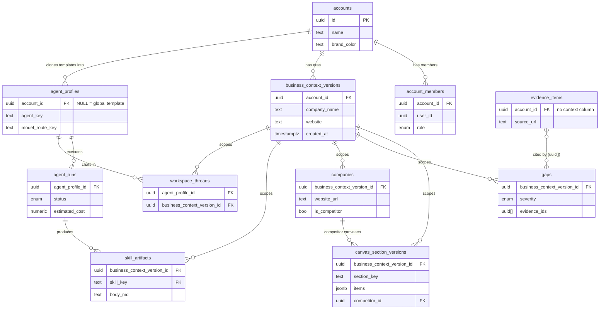

# Data Model

[← Back to Home](./Home.md)

This page documents the Postgres/Supabase data model behind Super BMC: the tenancy
layer, the company-era scoping law that partitions each account's data by company,
the core table groups, the RLS posture, and the migration conventions. Everything
below is grounded in `supabase/migrations/`, `supabase/schema.sql`,
`worker/src/db/company-scope.ts`, `src/lib/company-scope.ts`, and the
2026-07-07 security audit recorded in `docs/BUILD_STATE.md` (GOAL PHASE 6).

---

## 1. Tenancy model

### accounts + account_members

The multi-tenant root is two tables (created in
`20250624000001_canonical_tables.sql`, mirrored in `supabase/schema.sql`):

| Table | Key columns | Notes |
|---|---|---|
| `accounts` | `id`, `name`, `slug` (unique), `brand_color` | Tenant root. Members can SELECT (via membership subquery) and UPDATE (`accounts_update_member`, added for letterhead branding). Any authenticated user may INSERT a new account. |
| `account_members` | `id`, `account_id` → accounts, `user_id`, `role` (`account_member_role` enum: `owner` / `admin` / `editor` / `viewer`) | User ↔ account join. Policies are deliberately based on the caller's **own row** (`user_id = auth.uid()`), not `is_account_member()`, to avoid recursion — `is_account_member()` reads this table. |

### The 20260707200000 hardening

`20260707200000_rls_hardening.sql` (Goal Phase 6 security audit) reshaped
membership policies:

- **Bootstrap-only self-insert.** The original `account_members_insert_own`
  policy only checked `user_id = auth.uid()` — any authenticated user could
  join **any** account whose UUID they learned, unlocking every account-scoped
  table (rated CRITICAL). The replacement policy
  `account_members_insert_bootstrap` allows self-insert only when the target
  account has **no members yet**, checked via a new SECURITY DEFINER helper
  `account_has_members(_account_id)` (EXECUTE revoked from `public`/`anon`,
  granted to `authenticated`/`service_role`). This preserves the create-account
  flow; every later join must go through the service role (a future invite RPC).
- **No self role updates.** `account_members_update_own` let a member rewrite
  their own row — including `role -> 'owner'`. The policy is simply **dropped**;
  membership updates are service-role only.

### is_account_member()

Almost every RLS policy funnels through one helper (defined in
`supabase/schema.sql`):

```sql
create or replace function public.is_account_member(_account_id uuid)
returns boolean
language sql
stable
security definer
set search_path = public
as $$
  select exists (
    select 1 from public.account_members
    where account_id = _account_id and user_id = auth.uid()
  );
$$;
```

`SECURITY DEFINER` lets policies on other tables consult `account_members`
without granting callers direct read access to other people's membership rows,
and without recursing through `account_members`' own policies.

### Two ownership styles

The schema contains two generations of ownership:

1. **Legacy per-user tables** (Lovable-era, Oct 2025 migrations): `profiles`,
   `saved_analyses`, `leads`, `user_roles`, `strategic_frameworks` /
   `strategy_sessions` / `generated_reports`, `strategy_coaching_sessions`,
   `frameworks` / `framework_executions`. These carry a `user_id` column and
   RLS of the form `auth.uid() = user_id`. They predate accounts and are kept
   for backward compatibility (`business_context_versions.source_analysis_id`
   is a nullable soft ref to `saved_analyses`).
2. **Account-scoped tables** (everything from `20250624000001` onward): carry
   `account_id uuid references accounts(id)` and RLS via
   `is_account_member(account_id)`. Template-capable tables (`agent_profiles`,
   `model_routes`, `cascades`, `data_feeds`, `feed_cache`) allow
   `account_id IS NULL` rows as global defaults readable by all authenticated
   users; child tables (`mcp_server_tools`, `workspace_messages`,
   `cascade_steps`, `agent_profile_revisions`, `agent_document_revisions`)
   inherit access by joining to their parent's `account_id`.

### Two clients, two trust models

- **Frontend** (`src/integrations/supabase/client.ts`) uses the publishable
  (anon) key with the user's session JWT — every query is constrained by RLS;
  the policies above are the security boundary.
- **Worker** (`worker/src/index.ts`) creates its client with
  `SUPABASE_SERVICE_ROLE_KEY`, which **bypasses RLS entirely**. Tenancy for
  worker code is enforced in application code: every job carries an
  `account_id`, every query filters `.eq("account_id", ...)`, and company-era
  filters come from `worker/src/db/company-scope.ts`. The Phase 6 worker
  tenancy sweep fixed the last known gaps (a chat tool missing the era filter,
  a write path trusting a model-supplied context id, an unverified payload
  context id).

---

## 2. The company-era scoping law

**This is the single most important invariant in the data model.** Sources:
`worker/src/db/company-scope.ts` and `src/lib/company-scope.ts` (kept as exact
mirrors — the file headers say so), plus migrations `20260707120000`,
`20260707140000`, `20260707180000`.

### Why it exists

One account holds many companies over time: each URL/deck analysis creates a
new `business_context_versions` row, but every versioned table used to be read
account-wide — so opening Salesforce still surfaced Tier4's canvas rows, gaps,
competitors and briefings (owner bug 2026-07-06).

### The law

1. **Eras.** `business_context_versions` rows partition an account into company
   "eras", ordered by `created_at`.
2. **Active company.** The active company is whichever company the **newest**
   context belongs to (more precisely: the newest *named* context — leading
   anonymous rows belong to it).
3. **Scope.** The active company's scope is the set of **all** context ids that
   belong to that same company across the account's history — matched by
   normalized **website domain first, normalized company name second**
   (`normalizeDomain` strips protocol/`www.`/port/path; `normalizeCompanyName`
   lowercases, strips punctuation and legal suffixes like inc/llc/ltd/gmbh).
   Re-analyzing the same company therefore *extends its history* instead of
   orphaning it.
4. **Anonymous rows inherit.** Anonymous contexts ("Initial business context"
   ensure-rows with no name and no website) inherit the company of the
   **nearest older named context** — they were created into whatever era was
   active at the time. Anonymous rows older than every named context join the
   first era. An account with *only* anonymous contexts is degenerate: all
   contexts stay in scope (legacy behavior).

`computeCompanyScope(rows)` implements this as a pure function returning:

```ts
interface CompanyScope {
  activeContextId: string | null; // newest context id
  contextIds: string[];           // every context id of the active company
  companyKey: string | null;      // domain else normalized name
  companyName: string | null;
}
```

`loadCompanyScope()` fetches up to 500 context rows for the account and runs
the computation; the frontend version adds a 30-second per-account cache with
in-flight deduplication (a page render fans out to many scoped readers) and an
`invalidateCompanyScope()` escape hatch.

### The read/write rule

> **Reads filter, writes stamp.**
> Every read of a scoped table filters
> `.in("business_context_version_id", scope.contextIds)`;
> every write stamps `business_context_version_id: scope.activeContextId`.

Representative examples: `src/pages/Gaps.tsx` line 172
(`query.in("business_context_version_id", scope.contextIds)`) and
`worker/src/jobs/gap-engine.ts` lines 101/123 (reads `.in(...)`, insert stamps
`scope.activeContextId`). Consumers span the worker (skill modules,
`atlas-briefing`, `workspace-chat`, `skill-run`, `gap-engine`, `bmc-tools`) and
the frontend (Dashboard, Gaps, Knowledge, Atlas chat/shelf, workspace panels,
global search, competitor research hooks).

### Tables carrying business_context_version_id

Grepped from `supabase/migrations/`:

| Table | Since | Nullability / on delete | Notes |
|---|---|---|---|
| `canvas_section_versions` | `20250624000001` (born with it) | `NOT NULL`, `ON DELETE CASCADE` | The original versioned table; scoping native. |
| `gaps` | `20260707120000` | nullable, `ON DELETE SET NULL` | Legacy rows stay NULL and drop out of scoped reads; research repopulates. |
| `companies` | `20260707120000` | nullable, `ON DELETE SET NULL` | Competitor entities scoped per company era. |
| `skill_artifacts` | `20260707120000` | nullable, `ON DELETE SET NULL` | Deliverables shelf scoped per company. |
| `founder_documents` | `20260707140000` | nullable, `ON DELETE SET NULL` | User uploads must not vanish: NULL rows show in an explicit "not linked to a company" group with a one-tap assign action. |
| `workspace_threads` | `20260707180000` | nullable, `ON DELETE SET NULL` | Chat history starts clean per company; legacy NULL threads stay invisible rather than bleeding across companies. |

Deliberate exception, documented in BUILD_STATE: `evidence_items` has **no**
context column, so Evidence Coverage is honestly labeled account-wide in the UI
until a schema change adds per-company scoping.

---

## 3. Core table groups

### Strategy data

| Table | Purpose | Key columns | Scoping |
|---|---|---|---|
| `business_context_versions` | Versioned business context; the era-defining table | `account_id`, `version_number`, `company_name`, `website`, `industry`, `data jsonb`, `source_analysis_id` | account (RLS); *defines* company eras |
| `canvas_section_versions` | Append-only versions of each BMC section | `business_context_version_id` (NOT NULL), `section_key`, `items jsonb`, `confidence`, `freshness_status`, `groundedness_score`, `competitor_id` → companies | account + company era (native) |
| `evidence_items` | Citable evidence with provenance | `source_type` enum, `source_url`, `title`, `excerpt`, `created_by_agent_run_id` | account only (no context column — known limitation) |
| `gaps` | Detected strategy gaps | `gap_type`/`severity`/`status` enums, `affected_sections[]`, `evidence_ids[]`, `business_context_version_id` | account + company era |
| `companies` | Own company + competitor entities | `name`, `website_url`, `is_competitor`, `logo_url`, `brand_assets`, `business_context_version_id`; unique `(account_id, lower(website_url))` | account + company era |

### Agent runtime

| Table | Purpose | Key columns | Scoping |
|---|---|---|---|
| `agent_profiles` | The 9 BMC agents + Atlas; per-account clones of global templates | `agent_key`, `agent_type`, `assigned_sections[]`, `model_route_key`, `status`; unique `(account_id, agent_key)` + partial unique on global rows | account; `account_id IS NULL` = read-only global templates (writes hardened 20260707200000) |
| `agent_profile_revisions` | Versioned system instructions/behavior | `agent_profile_id`, `system_instructions`, `behavior jsonb`, `changed_by` | via parent profile's account |
| `agent_runs` | One LLM run: status, tokens, cost | `agent_profile_id`, `run_type`, `trigger_type`, `status`, `input`/`output jsonb`, `tokens_in/out`, `estimated_cost` | account |
| `agent_jobs` | Durable job queue the worker polls (with queue-locking RPC, `20260702110000`) | `kind`, `payload jsonb`, `status` (text state machine), `attempts`, `agent_run_id`, `cascade_run_id` | account; primarily service-role written |
| `model_routes` | Routing table replacing the hardcoded provider/model map | `route_key`, `provider`, `model_name`, `params jsonb`, `fallback_route_key`, `task_class`, cost columns; unique `(account_id, route_key)` + global partial unique | account; NULL rows = global defaults copied at provisioning |
| `scheduled_loops` | Cron-like recurring agent work with budgets | `schedule`, `action_key`, `max_runtime_minutes`, `monthly_budget`, `failure_count`, `next_run_at` | account |

### Workspace

| Table | Purpose | Key columns | Scoping |
|---|---|---|---|
| `workspace_threads` | Chat room between a human and one agent profile | `agent_profile_id`, `title`, `archived`, `business_context_version_id` | account + company era |
| `workspace_messages` | Messages within a thread | `thread_id`, `role` (text), `kind` enum, `content jsonb`, `agent_run_id` | via parent thread's account |
| `context_sources` | Per-agent context attachments (notes, URLs, files) | `agent_profile_id`, `thread_id`, `type`, `uri`, `config jsonb` | account |
| `insights` | Agent-surfaced findings | `agent_profile_id`, `severity`, `section_key`, `evidence_ids[]`, `read_at` | account; **SELECT-only** for users (worker writes) |
| `approvals` | Human-in-the-loop gate (e.g. outreach drafts) | `kind`, `payload jsonb`, `status`, `decided_by`, `expires_at` | account; SELECT + UPDATE for users, INSERT/DELETE service-role only |

(Adjacent: `agenda_items` — SELECT-only like insights; `cascades` /
`cascade_steps` / `cascade_runs` — multi-agent pipelines with a NULL-account
template library.)

### Knowledge

| Table | Purpose | Key columns | Scoping |
|---|---|---|---|
| `founder_documents` | Owner-uploaded decks/docs (deck-first onboarding); owner-provided evidence, never silently merged | `storage_bucket`/`storage_path`, `status` enum, `extracted_text`, `section_claims jsonb`, `business_context_version_id` | account + company era |
| `agent_documents` | Each agent's living knowledge doc | `agent_profile_id`, `doc_key`, `body_md`, `version`, `refresh_cadence`, `freshness_status`, `claim_sources jsonb`; unique `(account_id, agent_profile_id, doc_key)` | account |
| `agent_document_revisions` | Full version history of agent documents | `agent_document_id`, `version`, `body_md`, `material_change`, `change_summary`; unique `(agent_document_id, version)` | via parent document's account |
| `owner_questions` | Questions agents ask the owner (max 3 open per agent, trigger-enforced) | `agent_profile_id`, `question`, `why_needed`, `doc_key`, `status`, `answer` | account |
| `grounding_suggestions` | Agent-proposed concrete names for generic canvas items, verifier-gated | `section_key`, `item_text`, `suggested_text`, `evidence_id`, `status` | account; SELECT + UPDATE for users, INSERT service-role only |

### Skills

| Table | Purpose | Key columns | Scoping |
|---|---|---|---|
| `skill_catalog` | Global registry of the 27 signature skills | `skill_key` (PK), `agent_key`, `trigger_kinds[]`, `output_kind`, `implemented`, `orchestrator_can_trigger` | global; readable by all authenticated users |
| `skill_artifacts` | Typed skill outputs (markdown + JSON payload) | `skill_key` → catalog, `title`, `body_md`, `payload jsonb`, `evidence_ids[]`, `business_context_version_id` | account + company era; **SELECT-only** for users (worker writes) |
| `artifact_shares` | Tokenized public shares of artifacts | `artifact_id`, `token` (unique, ≥32 chars), `revoked`; one active share per artifact (partial unique) | account CRUD; public reads go through the shared-artifact Edge Function, never direct anon table access |

### Feeds

| Table | Purpose | Key columns | Scoping |
|---|---|---|---|
| `data_feeds` | Feed registry (Firecrawl, Grok search, FRED, Trends, GDELT, GitHub) | `feed_key`, `kind`, `tier`, `config jsonb`, `ttl_seconds`, `health`, `cost_class`; `unique nulls not distinct (account_id, feed_key)` | account overrides over NULL global defaults; SELECT-only for users (authenticated-only since 20260707200000) |
| `feed_cache` | TTL cache so agents reuse fetches before spending another call | `feed_key`, `cache_key`, `payload jsonb`, `evidence_candidates`, `expires_at`; unique `(account_id, feed_key, cache_key)` | same posture as data_feeds; worker writes |
| `watched_sources` | Per-agent monitored URLs/handles/queries | `agent_profile_id`, `kind`, `target`, `cadence`, `health`, `added_by` | account (full CRUD) |
| `metric_snapshots` | Computed metric time series (e.g. Threat Index) | `metric_key`, `section_key`, `value`, `inputs jsonb` (formula disclosure), `computed_at` | account; primarily worker-written |

---

## 4. RLS posture summary (2026-07-07 audit)

From the GOAL PHASE 6 entry in `docs/BUILD_STATE.md` plus
`20260707200000_rls_hardening.sql`:

**What the hardening migration fixed** (severity as recorded in the audit):

1. **CRITICAL** — `account_members` INSERT allowed joining any account by UUID
   (full cross-tenant takeover including credentials and storage). Now
   bootstrap-only self-insert via SECURITY DEFINER `account_has_members()`.
2. **HIGH** — self-service role escalation via `account_members` UPDATE:
   policy dropped, service-role only.
3. **HIGH** — `agent_profiles` INSERT/UPDATE accepted `account_id IS NULL`,
   letting any authenticated user rewrite the **global template agents'**
   system prompts served to every tenant. Writes now require a non-null
   account the caller belongs to; NULL rows remain readable via the untouched
   SELECT policy.
4. **LOW** — `data_feeds` / `feed_cache` SELECT had no role clause, so `anon`
   could read global feed configs and cached payloads. Now authenticated-only.

**Deliberately SELECT-only for users (worker writes via service role):**
`insights`, `agenda_items`, `skill_artifacts`, `data_feeds`, `feed_cache`.
`approvals` and `grounding_suggestions` add UPDATE (so a human can decide or
dismiss) but no INSERT/DELETE. The audit verified every table has RLS enabled
with a SELECT path for its intended reader.

**Storage bucket folder-scoping pattern:** both private buckets —
`founder-documents` (`20260704150000`) and `context-files` (`20260706005500`)
— require object paths to start with the account id, enforced per operation on
`storage.objects`:

```sql
bucket_id = '<bucket>'
and exists (
  select 1 from public.account_members am
  where am.user_id = auth.uid()
    and am.account_id::text = (storage.foldername(name))[1]
)
```

Known leftovers recorded honestly in BUILD_STATE: multi-user invites need an
invite RPC (self-join is now bootstrap-only), and a
migrations-vs-`schema.sql` DELETE-policy divergence is worth reconciling.

---

## 5. Entity relationship overview

The ~10 most central tables (not exhaustive — child/revision and feed tables
omitted for readability):



Note: `evidence_ids uuid[]` array references (on `gaps`, `insights`,
`skill_artifacts`, `agent_documents`) are soft links, not FK constraints.

---

## 6. Migration conventions

- **Timestamped files.** Every migration in `supabase/migrations/` is named
  `YYYYMMDDHHMMSS_description.sql` and applied in lexical order. Early files
  are hand-numbered (`20250624000001_canonical_tables.sql`), Lovable-era files
  carry UUID suffixes, and current work uses round timestamps with descriptive
  slugs (`20260707200000_rls_hardening.sql`).
- **Idempotent by rule.** Migrations follow the repo's idempotent convention
  (BUILD_PLAN rules 11/12, cited in `db-migrate.yml`): `create table if not
  exists`, `do $$ ... exception when duplicate_object` for enums,
  `drop policy if exists` before `create policy`, seeds via
  `on conflict ... do update`, and partial unique indexes on
  `account_id IS NULL` rows to make global template seeds re-runnable.
- **Catalog upserts never flip `implemented`.** The `skill_catalog` seed
  (`20260704210000`) upserts every skill's metadata `on conflict` but
  deliberately excludes `implemented` from the update list — implementation
  flags only move in explicit follow-on migrations
  (e.g. `20260706135158_phase_b_skills_implemented.sql`:
  "The base catalog upsert intentionally does not flip implemented on
  conflict"). This is the "no fake completeness" rule: the UI only offers
  skills a worker module actually backs.
- **Continuous deployment.** `.github/workflows/db-migrate.yml` runs on every
  push to `main` touching `supabase/migrations/**`: it links the Supabase
  project and runs `supabase db push --include-all`. On history drift it
  self-heals with the same reconciliation as the manual Ops task —
  `supabase migration repair` marks manually-applied remote rows reverted and
  records pre-cutoff repo files (below `20260705000000`, confirmed live in
  BUILD_STATE) as applied without re-running, then pushes the rest.
- **`schema.sql` is the consolidated baseline** (tables, `is_account_member`,
  model routes, RLS loops) and can drift slightly from migrations — the Phase 6
  audit flagged a DELETE-policy divergence between the two as worth
  reconciling.

---

[← Back to Home](./Home.md)
