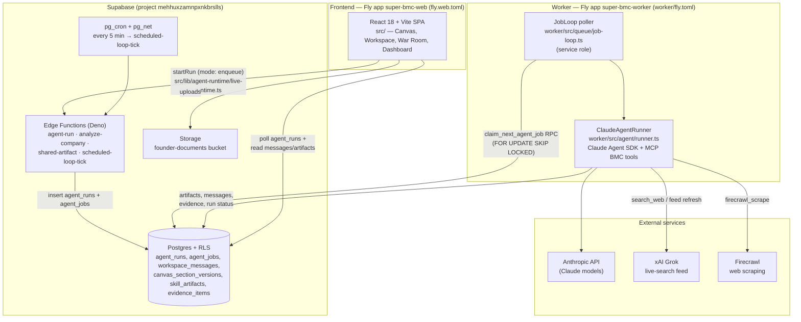

# Super BMC — Wiki Home

Welcome. This wiki is the map of the Super Business Model Canvas codebase for both the
owner and anyone (human or AI agent) onboarding to the repo. Every statement here is
grounded in the code — file paths are given so you can check for yourself.

---

## What Super BMC is

Super BMC is an AI-powered strategy workspace that keeps a company's business strategy
**evidence-cited and continuously current**. You point it at a company, and it generates a
full Business Model Canvas plus competitive landscape (see `README.md`). From there, a team
of ten AI agents works the strategy: **nine domain experts** — one per BMC section
(Compass, Forge, Relay, Anchor, Yield, Vault, Tempo, Envoy, Ledger; roster in
`src/lib/agent-roster.ts`) — and **Atlas**, a chief-strategist orchestrator that reads all
nine and keeps a ranked agenda. The agents run **27 catalog skills** (all real and
runnable end-to-end as of the 2026-07-07 "GOAL COMPLETE" entry in `docs/BUILD_STATE.md`:
20 module skills registered in `worker/src/jobs/skills/index.ts` plus 7 built-ins in
`worker/src/jobs/skill-run.ts`). Each skill run produces a durable, **evidence-cited
artifact document** — rendered with a bespoke exhibit and numbered sources, viewable
in-app at `/artifacts/:id` and publicly shareable via token links — per the definition of
done in `docs/GOAL_FINISH_LINE.md`. Live at superbmc.com.

---

## Architecture

Three deployed pieces — a React frontend and a Node worker on Fly.io, with Supabase
(Postgres + Auth + Edge Functions + Storage) between them — plus external AI and data
services. The frontend never holds provider API keys; the worker runs with the Supabase
service role.



Key facts behind the diagram:

- **Frontend** (`src/`): React 18 + TypeScript + Vite + Tailwind + shadcn/ui, deployed as
  Fly app `super-bmc-web` (`fly.web.toml`, `Dockerfile.web`). It talks to Supabase with
  the anon key and the user's session JWT only.
- **Supabase**: Postgres with RLS on every table (account-scoped policies; hardened in
  migration `20260707200000`). Edge functions live in `supabase/functions/` —
  `agent-run` (creates durable runs and enqueues worker jobs), `analyze-company`
  (URL → BMC analysis), `shared-artifact` (public token-gated artifact reads),
  `scheduled-loop-tick` (processes due `scheduled_loops`), plus chat/report functions.
  `pg_cron` + `pg_net` call `scheduled-loop-tick` every 5 minutes (migration
  `supabase/migrations/20260702090000_schedule_loop_tick.sql`).
- **Worker** (`worker/src/`): a Node background poller (no HTTP service) on Fly app
  `super-bmc-worker` with restart policy `always` and 1 GB RAM (`worker/fly.toml`). It
  uses the service-role key and runs agents with the **Claude Agent SDK**
  (`@anthropic-ai/claude-agent-sdk` `query()` in `worker/src/agent/runner.ts`, with
  `Bash`/`Write`/`Edit` disallowed) plus an in-process MCP tool server
  (`worker/src/tools/bmc-tools.ts`: `read_canvas`, `write_section_items`,
  `log_evidence`, `open_gap`, `post_insight`, `read_competitor_canvas`, `search_web`,
  `firecrawl_scrape`, `run_skill`).
- **Durable-run flow**: the UI calls `startRun()` (`src/lib/agent-runtime/`), which in
  enqueue mode POSTs to the `agent-run` edge function; that inserts an `agent_runs` row
  and an `agent_jobs` row. The worker claims jobs atomically via the
  `claim_next_agent_job` Postgres function (`FOR UPDATE SKIP LOCKED`, migration
  `20260702110000_agent_job_queue_locking.sql`), executes them, and writes artifacts,
  messages, and run status back to Postgres. The UI **polls** — no streaming (true token
  streaming is explicitly out of scope in `docs/GOAL_FINISH_LINE.md`).

---

## How a request flows (workspace chat, end to end)

Concrete example: you type a message to a section agent in its workspace room.

1. **Chat message.** `src/components/workspace/WorkspaceThread.tsx` inserts your message
   into `workspace_messages`, then calls `getAgentRuntime(accountId).startRun()` with
   `runType: "workspace_chat"`.
2. **Enqueue.** In enqueue mode, `src/lib/agent-runtime/live-runtime.ts` POSTs
   `{ mode: "enqueue", ... }` to the `agent-run` edge function
   (`supabase/functions/agent-run/index.ts`), which creates a durable `agent_runs` row
   and inserts a matching `agent_jobs` row.
3. **Worker claims the job.** The `JobLoop` (`worker/src/queue/job-loop.ts`) polls
   `claim_next_agent_job` and hands the job to the dispatcher
   (`worker/src/jobs/dispatch.ts`), which routes `kind: "workspace_chat"` to
   `worker/src/jobs/workspace-chat.ts`.
4. **Runner with MCP tools.** The handler loads the thread, agent profile, company-scoped
   canvas snapshot, gaps, and implemented skills, then runs `ClaudeAgentRunner` with the
   BMC MCP tool server — so the agent can read the canvas, log evidence, open gaps, and
   enqueue its own room's skills (`run_skill`) instead of just describing them.
5. **Reply message.** The handler writes the agent's reply into `workspace_messages` and
   marks the `agent_runs` row completed (or `failed` with an honest error — see
   `markAgentRunFailed` in `worker/src/jobs/dispatch.ts`).
6. **Poll.** The UI's `pollRun()` polls the `agent_runs` row until it reaches a terminal
   status, then reloads the thread so the reply appears.

Skill runs follow the same shape with `kind: "skill_run"` — the artifact lands in
`skill_artifacts` with evidence rows, and the shelf/Studio tiles poll the run to
completion.

---

## Repo map

| Path | What lives there |
| --- | --- |
| `src/` | Frontend SPA: `pages/` (Canvas, Workspace, WarRoom, Dashboard, Knowledge, …), `components/`, `hooks/`, `lib/` (agent runtime client, `company-scope.ts`, Atlas contracts), `integrations/` (Supabase client) |
| `worker/src/` | The agent worker: `jobs/` (dispatcher + handlers incl. `skills/` modules), `tools/` (MCP BMC tool server), `queue/` (job loop + repository), `feeds/` (Grok live search, Firecrawl fetchers), `agent/` (Claude Agent SDK runner, guardrails, limits) |
| `supabase/` | Backend: `migrations/` (53 incremental SQL files — the deploy source of truth), `functions/` (Deno edge functions), `schema.sql` mirror, `SETUP.md` |
| `.github/workflows/` | `deploy.yml` (push to main → deploy web + worker to Fly), `db-migrate.yml` (push → apply migrations), `edge-deploy.yml` (push → deploy edge functions), `diagnose.yml` (worker diagnostics), `ops.yml` (manual ops tasks) |
| `docs/` | `BUILD_STATE.md` (live build tracker + review findings), `GOAL_FINISH_LINE.md` (definition of done), `HANDOFF_NEXT_BUILD.md` (rules + known-fragile spots; the incoming-agent handoff is `HANDOFF.md` at repo root), `specs/` (numbered product specs) |

---

## Wiki index

- [Frontend](./Frontend.md) — pages, routing, hooks, the agent-runtime client, chat and
  artifact rendering.
- [Worker](./Worker.md) — job loop, dispatcher, handlers, MCP tools, feeds, guardrails.
- [Skills](./Skills.md) — the 27-skill catalog, the toolkit pattern, how to add a skill.
- [Data Model](./Data-Model.md) — tables, RLS, company-era scoping, evidence and
  artifacts.
- [Operations](./Operations.md) — deploys, migrations, secrets, diagnosing a stuck queue.

---

## House laws

> **The three laws every change must obey** (from `docs/GOAL_FINISH_LINE.md` and
> `docs/HANDOFF_NEXT_BUILD.md`):
>
> **1. Company-era scoping law.** Every read AND write of company-derived data (canvas,
> gaps, competitors, artifacts, briefings, documents, threads) must be scoped to the
> active company era via `loadCompanyScope` (`worker/src/db/company-scope.ts`, mirrored
> by `src/lib/company-scope.ts`). An unscoped account-wide query reintroduces the
> cross-company pollution bug. No known company bleed is a launch requirement.
>
> **2. Honest-numbers law.** Every dashboard/workspace metric is computed from real data
> or removed. No decorative numbers. Skills fail loudly with actionable messages when
> inputs are missing; never write an artifact from unverifiable model output
> (parse-or-throw).
>
> **3. Gates before every commit.** Quoted from the most recent gate block in
> `docs/BUILD_STATE.md` (Phase 6 commit):
>
> ```
> cd worker && npx tsc --noEmit          -> exit 0
> cd worker && npx vitest run            -> 382 passed, 2 skipped
> cd worker && npm run build             -> exit 0
> cd worker && npx eslint src            -> exit 0
> npx tsc -p tsconfig.app.json --noEmit  -> exit 0
> npx tsc -p tsconfig.node.json --noEmit -> exit 0
> npm run build                          -> green
> npm run lint                           -> 64 problems, within frozen <=65 ceiling
> UTF-8 touched-file decode              -> encoding clean, exit 0
> ```
>
> The frontend lint ceiling is frozen at 65; the UTF-8 check guards against cp1252
> mojibake in touched files. Run the full suite before every commit — no exceptions.
