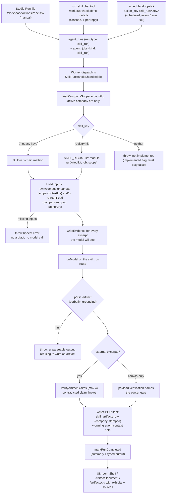

# Skills

[← Home](./Home.md)

Skills are the signature workflows of the nine section agents. Each skill is a background job that reads the active company's canvas (and, for feed-based skills, live search/crawl evidence), runs one or more model steps, and ships exactly one **typed artifact**: a markdown body plus a JSON payload plus evidence links, written to `skill_artifacts` and mirrored into the owning agent's chat context. The system's core promise is *no fake completeness*: a skill either produces a verified, evidence-grounded document or fails loudly — it never invents numbers, quotes, or verifier passes.

All 27 catalog skills are implemented as of migration `20260707190000_goal_phase1_skills.sql` (see `docs/GOAL_FINISH_LINE.md`, Definition of DONE item 1: "Every skill tile is real").

---

## 1. The skill system end-to-end

### The catalog: `skill_catalog`

`supabase/migrations/20260704210000_skill_catalog.sql` creates two tables:

- **`skill_catalog`** — the global registry of the 27 signature skills: `skill_key` (PK, e.g. `vault.moat_audit`), `agent_key`, `title`, `description`, `trigger_kinds` (`manual` / `atlas` / `cadence` / `event`), `output_kind`, `implemented`, `orchestrator_can_trigger`, `sort_order`. Readable by all authenticated users.
- **`skill_artifacts`** — the typed outputs: `account_id`, `skill_key`, `title`, `body_md`, `payload` (jsonb), `evidence_ids` (uuid[]), `inputs`, `agent_run_id`, plus `business_context_version_id` (company scoping, added later) — owner-readable via `is_account_member`.

The **`implemented` flag gates the UI**. The base migration's `on conflict ... do update` deliberately never touches `implemented`; only explicit follow-on migrations flip it, and only for keys the worker actually executes. An unimplemented skill renders as a disabled "Coming" tile; the worker throws `skill <key> is not implemented in the worker (catalog implemented flag must stay false)` if one is ever enqueued anyway (`worker/src/jobs/skill-run.ts`).

### Three launch paths

All three converge on the same durable pair: an `agent_runs` row (`run_type: "skill_run"`) plus an `agent_jobs` row (`kind: "skill_run"`, payload `{ skill_key, business_context_version_id }`).

1. **Studio Run tile** — `src/components/workspace/WorkspaceActionsPanel.tsx`. Each workspace room lists its agent's catalog rows; clicking Run on an implemented tile resolves the active company context (`ensureBusinessContext`), calls `getAgentRuntime(accountId).startRun({ runType: "skill_run", triggerType: "manual", input: { skill_key, business_context_version_id } })`, then polls run status every 3 s (max 100 attempts). A synchronous `startingRef` guard prevents the double-click double-enqueue that hit production. Finished artifacts land on the room's "Shelf" below the tiles.
2. **`run_skill` chat tool** — `worker/src/tools/bmc-tools.ts`. A section agent chatting in its workspace can start one of *its own room's* implemented skills. The tool enforces: one skill run per reply (`skillRunStartedThisReply`), skill must exist and be implemented (denials list the room's real runnable keys — a live 2026-07-07 incident had Vault guessing keys and hand-writing the audit), the skill must belong to the calling agent's room, and an analyzed company must exist. It inserts the run (`trigger_type: "cascade"`) then the job, and rolls the run to `failed` if the job insert fails — never a pending run with no job behind it.
3. **Scheduled loops** — `supabase/functions/scheduled-loop-tick/index.ts`, invoked every 5 minutes by pg_cron (`20260702090000_schedule_loop_tick.sql`). A `scheduled_loops` row with `action_key = "skill_run:<skill_key>"` is mapped by `enqueueSpecForActionKey` to `{ runType: "skill_run", input: { skill_key } }` and enqueued through the `agent-run` edge function — the exact same run+job pipeline as manual work. Unknown action keys fail loudly instead of falling back.

### The worker: `SkillRunHandler`

`worker/src/jobs/dispatch.ts` routes `kind === "skill_run"` jobs to `SkillRunHandler.handle` (`worker/src/jobs/skill-run.ts`). The handler:

1. Reads `skill_key` from the job payload (throws if missing) and marks the `agent_runs` row `running`.
2. Loads the **company scope** (`loadCompanyScope`) — skills read and write only the ACTIVE company's data. Competitor lists and canvas items from a previously analyzed company must never feed another company's artifact (owner bug, 2026-07-06).
3. Walks a **built-in if-chain of 7 legacy skills** implemented as private methods: `yield.pricing_teardown`, `compass.avatar_refinement`, `compass.segment_expansion`, `relay.channel_gap_scan`, `relay.channel_economics`, `forge.differentiator_audit`, `forge.proof_gap_scan`.
4. Otherwise consults **`SKILL_REGISTRY`** (`worker/src/jobs/skills/index.ts`) — a `Map<string, SkillRun>` of the 20 standalone modules (Phases G + Goal-1). A registered skill runs against the handler's toolkit: `await registered(this.toolkit(), job, scope)`.
5. If neither matches, it throws the not-implemented error.

Every successful skill ends the same way: a `skill_artifacts` row stamped with `business_context_version_id = scope.activeContextId`, a best-effort **context note** mirrored into the owning agent's `context_sources` (`config.source = "skill_artifact"`, capped at the 5 newest artifact-sourced notes per profile, user notes untouched), and `markRunCompleted` on the `agent_runs` row with a summary and typed output.

### Lifecycle flowchart

---

## 2. The full 27-skill catalog

Rooms map to agents via `src/lib/agent-roster.ts` callsigns. Descriptions below are the current catalog text — the base migration (`20260704210000`) for skills whose flip migration did not rewrite the description (Phase B, `20260706135158`, flipped four flags without new text; `yield.pricing_teardown` shipped implemented in the base migration), and the rewritten descriptions from the flip migrations `20260707150000` (Phase F), `20260707170000` (Phase G), and `20260707190000` (Goal Phase 1) everywhere they exist.

| skill_key | Room / agent | What it does |
|---|---|---|
| `yield.pricing_teardown` | Yield / `agent_revenue_streams` | Crawls competitor pricing, normalizes models and price points into a matrix, positions yours, recommends a strategy with scenarios. |
| `yield.monetization_gaps` | Yield / `agent_revenue_streams` | Ranked list of monetization models competitors run that you do not, each citing the competitor's verbatim canvas text plus an adoption rationale and a concrete first experiment. |
| `yield.wtp_signals` | Yield / `agent_revenue_streams` | Per-segment willingness-to-pay read (underpriced/overpriced/aligned/unknown) from live review excerpts about the analyzed company's pricing — every read quotes a retrieved review verbatim. |
| `envoy.supply_chain_map` | Envoy / `agent_key_partnerships` | Maps the analyzed company's upstream suppliers and downstream distribution from live industry-search evidence; scored, excerpt-quoted, verifier-spot-checked partnership candidates. |
| `envoy.partner_outreach` | Envoy / `agent_key_partnerships` | One personalized outreach DRAFT per top supply-chain-map candidate (up to 5), grounded verbatim in each candidate's map rationale — an approval surface, never sent autonomously. |
| `envoy.ecosystem_watch` | Envoy / `agent_key_partnerships` | Verifier-spot-checked read of competitor partnership announcements from live search, each with a verbatim evidence quote and a counter-partner suggestion. |
| `relay.channel_gap_scan` | Relay / `agent_channels` | Where competitors get distribution versus you, ranked by effort and impact. |
| `relay.watering_holes` | Relay / `agent_channels` | Ranked, evidence-quoted map of where each segment congregates online/offline, with a concrete norm-respecting entry strategy per watering hole. |
| `relay.channel_economics` | Relay / `agent_channels` | CAC posture per channel from public signals; pairs with Ledger. Unknowns are exactly "unknown — not published". |
| `compass.avatar_refinement` | Compass / `agent_customer_segments` | Mines reviews/communities for the segment's own words; updates ICP cards and messaging hooks. |
| `compass.segment_expansion` | Compass / `agent_customer_segments` | Adjacent segments competitors serve, scored by fit with your capabilities. |
| `compass.message_market_fit` | Compass / `agent_customer_segments` | Before/after table rewriting each value-prop line in the segment's own language (uses the latest avatar-refinement artifact when one exists), honestly marking lines with no segment language yet. |
| `forge.differentiator_audit` | Forge / `agent_value_propositions` | Compares your Value Propositions items against every researched competitor's claims and classifies each as unique, contested (naming the competitor), or table stakes. |
| `forge.proof_gap_scan` | Forge / `agent_value_propositions` | Flags VP items with no linked evidence or an "Assumption:" label, suggests an evidence source for each, and opens one Gap Register entry per proof gap. |
| `forge.positioning_brief` | Forge / `agent_value_propositions` | One-page positioning brief from VP + Customer Segments items (plus prior differentiator-audit and avatar-refinement artifacts): a six-part positioning statement, verbatim-grounded message pillars, tone notes. |
| `anchor.churn_signal_audit` | Anchor / `agent_customer_relationships` | Excerpt-grounded complaint theme clusters from live-searched reviews of your company and competitors, labeled own vs competitor, each mapped to a concrete retention play. |
| `anchor.lifecycle_map` | Anchor / `agent_customer_relationships` | Six-stage lifecycle map artifact — your motion vs. verified competitor motions per stage, with gap flags and recommendations. |
| `anchor.advocacy_engine_scan` | Anchor / `agent_customer_relationships` | Verifier-spot-checked playbook of competitor advocacy mechanisms (referral/community/champion programs), each with a verbatim labeled evidence quote and an equivalent move sized for your scale. |
| `tempo.operational_benchmark` | Tempo / `agent_key_activities` | Per-activity gap analysis showing where competitors visibly invest (hiring and launches, with verbatim quotes), honestly marking activities with no public signal. |
| `tempo.build_vs_buy` | Tempo / `agent_key_activities` | Build-vs-buy verdict table (keep_in_house / consider_buying / strong_buy_candidate) per Key Activity, with excerpt-quoted market alternatives, switching sketches, and a verifier spot-check. |
| `tempo.velocity_watch` | Tempo / `agent_key_activities` | Per-competitor recent-shipping read with verbatim-quoted observations and an overall outshipping insight that honestly declares itself evidence-too-thin when no delta is grounded. |
| `vault.moat_audit` | Vault / `agent_key_resources` | Classifies every Key Resources item into a moat class with a 1-5 durability score, producing a Moat audit artifact plus a resources/durable run summary. |
| `vault.single_point_scan` | Vault / `agent_key_resources` | Parser-grounded risk register of key-person, single-supplier, platform-dependency, and concentration risks with severity, exposure, and a mitigation first step; severity-4+ risks open Gap Register rows. |
| `vault.talent_radar` | Vault / `agent_key_resources` | Per-competitor hiring-signal read by function from live-searched job-posting excerpts — each signal quoted verbatim, thin evidence stated honestly — with an inferred next move per competitor. |
| `ledger.cost_benchmark` | Ledger / `agent_cost_structure` | Benchmarks your costs against your archetype's typical mix — your numbers quoted verbatim from the canvas, archetype norms labeled as model knowledge, one "Cost input:" gap row per ungroundable category. |
| `ledger.unit_economics_frame` | Ledger / `agent_cost_structure` | Fills a fixed six-variable unit economics frame (CAC, ACV/ARPA, gross margin, retention/churn, payback, LTV) strictly from Revenue Streams and Cost Structure items; every ungroundable variable opens a Gap Register owner-input row. |
| `ledger.efficiency_scan` | Ledger / `agent_cost_structure` | Ranked vendor/tooling shortlist attacking your named cost drivers — each row names one of your cost drivers verbatim with a verbatim evidence quote and expected-impact rationale. |

---

## 3. The SkillToolkit contract

`worker/src/jobs/skills/toolkit.ts` defines the contract between `SkillRunHandler` and standalone skill modules. Every method is backed by the **exact same private helpers the built-in skills use** — a registered skill cannot bypass the invariants. A skill is just `type SkillRun = (toolkit, job, scope) => Promise<void>`.

| Helper | Guarantee |
|---|---|
| `client` | Service-role Supabase client. Every query MUST be account-scoped and company-scoped. |
| `loadOwnSectionItems(accountId, sectionKey, scope)` | Latest own-canvas items for a section, confined to the active company's context chain (`.in("business_context_version_id", scope.contextIds)`, `competitor_id is null`, latest row only). |
| `loadCompetitorSectionItems(...)` | Latest competitor-canvas items for a section, same company-scoping, joined to competitor names. |
| `loadCompetitors(accountId, scope)` | The active company's researched competitor entities (`companies` where `is_competitor`, era-scoped). |
| `refreshFeed(request)` | Cached feed fetch (`firecrawl_scrape`, `grok_live_search`, ...). **Callers must company-scope the `cacheKey`** (e.g. `` `supply_chain_map:${accountId}:${slug(companyName)}` ``) — without the company slug, re-analyzing a different company within the feed TTL would serve the previous company's cached excerpts. |
| `loadModelRoutes` / `requiredRoute` / `budgetForRoute` | Model routes for the given task classes (account overrides win over global rows); `requiredRoute` throws if the route is missing; `budgetForRoute` derives the per-step USD cap. |
| `runModel(stepLabel, route, request)` | One labeled model step with the process-failure retry policy; the route decides Anthropic vs OpenRouter runner. |
| `verifyArtifactClaims(job, verifyRoute, checks, label)` | Verifier spot-check on the `research_verify` route, up to 4 `{claim, excerpt}` pairs. A **contradicted** claim throws (no artifact ships); zero usable checks also throws (`"<label> has no evidence-backed claims to verify"`). Returns `{ checked, confirmed }` for the payload. |
| `loadLatestArtifact(accountId, scope, skillKey)` | Latest artifact this skill family already produced for the active company — the synthesis input for stacking skills (positioning brief, partner outreach, message-market fit). |
| `writeEvidence(job, {title, sourceUrl, excerpt})` | Evidence row on `evidence_items`, deduped on account+source_url+excerpt, tagged with the running skill's key. **Called before the prompt**: every excerpt the model sees lands on the evidence ledger first, so `evidence_ids` point at what the model actually saw. |
| `writeSkillArtifact(job, scope, artifact)` | The one way to ship output: inserts the `skill_artifacts` row stamped with `scope.activeContextId`, then mirrors a summary note into the owning agent's `context_sources` (best-effort — a failed note never fails the run; 5 newest artifact notes kept). |
| `markRunCompleted(job, summary, output)` | Flips the `agent_runs` row to `completed` with summary + typed output. |
| `parseJsonObject(text)` | Lenient JSON-object extraction from a model reply (code fences stripped, outermost braces). |
| `formatItems` / `competitorExcerpt` / `unique` / `truncateText` | Prompt-formatting and hygiene helpers shared with the built-ins. |

---

## 4. House patterns

These conventions repeat across all 27 skills; the named files are canonical examples.

**Parse-or-throw verbatim grounding** — `worker/src/jobs/skills/moat-audit.ts`. The parser is the never-invent gate, not the prompt. `parseMoatAuditArtifact` drops any row whose `resource` is not one of OUR canvas items verbatim (`allowed.has(resource)`) or whose `moat_class` is unrecognized, and returns `null` unless *every* own resource comes back classified — "a partial audit would silently hide the very resources most likely to be weak." A `null` parse throws `"moat_audit produced unparseable output; refusing to write an artifact"`; nothing is ever written from a bad parse. The same shape recurs everywhere: `unit-economics-frame.ts` downgrades any value without a verbatim canvas quote to `unknown`; `monetization-gaps.ts` rejects the whole parse when a quote is not a verbatim substring of the *named* competitor's items.

**Feed-based skills with verifier spot-checks** — `worker/src/jobs/skills/supply-chain-map.ts`. Live-evidence skills: (1) `refreshFeed` with a company-scoped cacheKey; (2) throw honestly if the feed is unhealthy or empty ("could not retrieve industry evidence — check the Grok search feed"); (3) `writeEvidence` for every excerpt *before* prompting; (4) parser enforces each candidate's `evidence_quote` appears verbatim in one of the excerpts — "a candidate cited from the model's memory is dropped, not shipped"; (5) `verifyArtifactClaims` spot-checks the top candidates against the excerpt containing their quote; a contradiction aborts the run. The `{ checked, confirmed }` result ships in the payload as `spot_check` and renders in the document header.

**Gap-opening skills with supersede-then-insert idempotency** — `worker/src/jobs/skills/unit-economics-frame.ts` (also `forge.proof_gap_scan` in `skill-run.ts`, `vault.single_point_scan`, `ledger.cost_benchmark`). Skills that open Gap Register rows first mark their *own prior open rows* superseded (matched by `gap_type` + a stable title prefix like `"Unit economics input:%"`, era-scoped via `scope.contextIds`, statuses `open`/`acknowledged`), then insert fresh rows — re-runs never duplicate. The supersede runs even when nothing is unknown anymore, so a variable the owner has since filled in doesn't keep a stale open row. Gap writes run **before** the artifact write, so a register failure never leaves an artifact claiming gaps that were never opened.

**Honest missing-input errors** — every skill checks its required inputs up front and throws a named, actionable error before any model call: `"monetization_gaps requires our Revenue Streams canvas items first"`, `"pricing_teardown requires at least one competitor entity — run competitor research first"`, `"supply_chain_map requires an analyzed company first"`. No artifact, no model spend, and the run error surfaces verbatim on the Studio tile.

**Never fake a verifier pass** — canvas-only skills have no external excerpt for a verifier to check against, so no spot-check runs; instead `payload.verification` names the parser guarantee that actually gated the output: `"parser_strict_all_rows"` (moat audit), `"parser_quote_gated"` (unit economics), `"parser_verbatim_competitor_quotes"` (monetization gaps), `"parser_grounded_rows"` (message-market fit, single-point scan). Tests assert this field explicitly ("the payload names the parser gate, never a fake verifier pass" — `worker/src/__tests__/skills/monetization-gaps.test.ts`).

---

## 5. How to add a skill

Follow the Phase G recipe — one new module file plus one line of shared-file churn (the registry entry).

1. **Catalog row.** If the skill is genuinely new (not one of the 27), add it to the base-catalog pattern: an `insert ... on conflict (skill_key) do update` migration setting `skill_key`, `agent_key`, `title`, `description`, `trigger_kinds`, `output_kind`, `sort_order` — and `implemented = false`. Never flip `implemented` in the base upsert (`20260704210000_skill_catalog.sql` is the template; the conflict clause deliberately omits `implemented`).
2. **Module file.** Create `worker/src/jobs/skills/<skill-name>.ts` exporting a `SkillRun` (e.g. `export const runMySkill: SkillRun = async (toolkit, job, scope) => { ... }`). Load required inputs via the toolkit and throw honest errors when they are missing; company-scope any feed cacheKey; `writeEvidence` before prompting; write an exported `parseXArtifact(text, groundingInputs)` that enforces verbatim grounding and returns `null` on any violation; `verifyArtifactClaims` for external excerpts or `payload.verification` for canvas-only; finish with `writeSkillArtifact` + `markRunCompleted`. Copy the doc-comment style: state what grounds the skill and which gate verifies it.
3. **Tests.** `worker/src/__tests__/skills/<skill-name>.test.ts` using the shared harness (`worker/src/__tests__/skills/harness.ts`) and `SkillRunHandler.runSkillModule(runMySkill, makeSkillJob("room.my_skill"))` — the test seam that resolves scope and hands the module the real toolkit. The harness convention: `SkillFakeClient` seeds two company eras on one account — **`ctx-1` (Acme Robotics) is active; `ctx-0` (Old Ventures) is the previously analyzed company** — and its fake honors `.in("business_context_version_id", ...)` the way postgrest would. `addTrapRow(sectionKey, text)` plants a *newer* own-canvas row in the `ctx-0` era: if your query forgets company scoping, the trap row wins latest-per-section and your prompt assertion (`expect(mainPrompt).not.toContain("Stale old-company text")`) catches it. Also cover: the happy path (artifact stamped `business_context_version_id: "ctx-1"`), honest missing-input failures (no artifact, no model call), parser rejection of ungrounded quotes, and the parser unit tests directly. Use `ScriptedSkillRunner(mainJson, verifyJson)` for model replies and `makeFakeFeedRunner({ "cache_prefix": [...] })` for feeds.
4. **Registry entry.** One import + one `SKILL_REGISTRY.set`-style map entry in `worker/src/jobs/skills/index.ts`. A key present in the registry but not flipped in the catalog simply never gets enqueued.
5. **Implemented-flip migration.** A follow-on migration that sets `implemented = true` and rewrites `description` to state exactly what the skill consumes and produces — the catalog tiles are the UI contract (`20260707170000_phase_g_skills.sql` is the template).
6. **Exhibit.** Give the artifact a bespoke document rendering: a payload parser (`src/components/skills/goal-payloads-*.ts` pattern — returns `null` on contract failure), an exhibit component (`GoalExhibits*.tsx`), and a `case "room.my_skill":` in `src/components/skills/GoalExhibitDispatch.tsx`. Unknown keys/failed parses render nothing — the markdown body always carries the content.
7. **Gates.** Run the full gate suite before committing (per `docs/GOAL_FINISH_LINE.md`): app + node `tsc`, `vite build`, `eslint` within the frozen ceiling, and in `worker/`: `npm run typecheck`, `npm test` (vitest), `npm run build`, `npm run lint`.

---

## 6. From artifact to document

An artifact row becomes a paper-styled document via `src/components/skills/ArtifactDocument.tsx`: header (title, date, evidence count, "verifier confirmed n/m spot-checks" when `payload.spot_check` exists), then the skill-specific **exhibit** (typed tables/cards parsed from `payload` — the 7 legacy exhibits inline, Phase G via `PhaseGExhibits.tsx`, and the 14 Goal-1 exhibits through `GoalExhibitDispatch`), then the markdown `body_md`, then a numbered **Sources** section rendering each evidence item's title, exact excerpt, and link — NotebookLM-style, so the reader can check every claim against what it stands on. The document appears in three places: the room Shelf drawer, the full page at `/artifacts/:id` (which loads `evidence_ids` into source cards), and the public share page. See [Frontend](./Frontend.md) for routing, branding, and share details.
