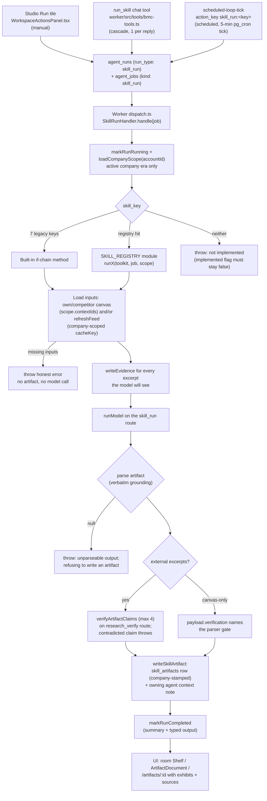

# Skills

[← Home](./Home.md)

Skills are the signature workflows of the nine section agents. Each skill is a background job that:

1. reads the active company's canvas (and, for feed-based skills, live search/crawl evidence),
2. runs one or more model steps on configured model routes,
3. ships exactly one **typed artifact** — a markdown body plus a JSON payload plus evidence links — written to `skill_artifacts` and mirrored into the owning agent's chat context.

The system's core promise is *no fake completeness*: a skill either produces a verified, evidence-grounded document or fails loudly. It never invents numbers, quotes, or verifier passes.

All 27 catalog skills are implemented as of migration `20260707190000_goal_phase1_skills.sql` (see `docs/GOAL_FINISH_LINE.md`, Definition of DONE item 1: "Every skill tile is real").

---

## 1. The skill system end-to-end

### The catalog: `skill_catalog`

`supabase/migrations/20260704210000_skill_catalog.sql` creates two tables:

- **`skill_catalog`** — the global registry of the 27 signature skills:
  - `skill_key` (PK, e.g. `vault.moat_audit`) — the `<room>.<skill>` identifier used everywhere,
  - `agent_key` — the owning section agent (e.g. `agent_key_resources`),
  - `title`, `description` — the tile copy; "the catalog tiles are the UI contract",
  - `trigger_kinds` — any of `manual`, `atlas`, `cadence`, `event`,
  - `output_kind` — e.g. `matrix_board`, `ranked_list`, `report`, `one_pager`,
  - `implemented` (default `false`), `orchestrator_can_trigger`, `sort_order`.
  - Readable by all authenticated users (RLS policy `skill_catalog_read_all`).
- **`skill_artifacts`** — the typed outputs: `account_id`, `skill_key` (FK to the catalog), `title`, `body_md`, `payload` (jsonb), `evidence_ids` (uuid[]), `inputs` (jsonb), `agent_run_id`, `created_at`, plus `business_context_version_id` for company scoping (added by the later company-scoping migrations). Owner-readable via `is_account_member(account_id)`.

The **`implemented` flag gates the UI**. The base migration's `insert ... on conflict (skill_key) do update` deliberately updates every column *except* `implemented`:

```sql
on conflict (skill_key) do update set
  agent_key = excluded.agent_key,
  title = excluded.title,
  description = excluded.description,
  trigger_kinds = excluded.trigger_kinds,
  output_kind = excluded.output_kind,
  sort_order = excluded.sort_order;
```

Only explicit follow-on migrations flip `implemented`, and only for keys the worker actually executes:

- `20260704210000` — `yield.pricing_teardown` ships implemented in the base seed.
- `20260706135158_phase_b_skills_implemented.sql` — flips `compass.avatar_refinement`, `compass.segment_expansion`, `relay.channel_gap_scan`, `relay.channel_economics` (flags only, descriptions unchanged).
- `20260707150000_phase_f_forge_skills.sql` — flips `forge.differentiator_audit`, `forge.proof_gap_scan` with rewritten descriptions.
- `20260707170000_phase_g_skills.sql` — flips the six Phase G standalone modules with rewritten descriptions.
- `20260707190000_goal_phase1_skills.sql` — flips the final 14 with rewritten descriptions; "every room's tile is now real".

An unimplemented skill renders as a disabled "Coming" tile in the Studio; if one is somehow enqueued anyway, the worker throws:

```
skill <key> is not implemented in the worker (catalog implemented flag must stay false)
```

The base migration also seeds the global `skill_run` model route (`model_routes` row: anthropic / claude-sonnet-5, task class `skill_run`), which every skill resolves at run time — account-level rows override the global one.

### Three launch paths

All three converge on the same durable pair: an `agent_runs` row (`run_type: "skill_run"`) plus an `agent_jobs` row (`kind: "skill_run"`, payload `{ skill_key, business_context_version_id }`).

**1. Studio Run tile** — `src/components/workspace/WorkspaceActionsPanel.tsx`

- Each workspace room queries `skill_catalog` for its agent's rows (ordered by `sort_order`) and renders them as tiles; `implemented: false` tiles show a "Coming" badge and a disabled button.
- Clicking Run resolves the active company context (`ensureBusinessContext` — the active company's newest context, "never a stale prior-company row", creating version 1 if none exists), then calls `getAgentRuntime(accountId).startRun({ runType: "skill_run", triggerType: "manual", input: { skill_key, business_context_version_id } })`.
- The panel polls run status every 3 s (`RUN_POLL_INTERVAL_MS`), up to 100 attempts, then toasts completion or surfaces the run error on the tile.
- A synchronous `startingRef` guard backs up the `runningRun` state check — "a fast double-click passes the null check twice before the re-render lands — that enqueued two identical runs in production."
- Finished artifacts appear on the room's **Shelf** below the tiles (refreshed every 30 s, filtered to the active company's `contextIds` so a company switch never leaves the previous company's documents on display), opening in a `FocusDrawer` as an `ArtifactDocument` or full-page at `/artifacts/:id`.

**2. `run_skill` chat tool** — `worker/src/tools/bmc-tools.ts`

A section agent chatting in its workspace can start one of *its own room's* implemented skills as a background run. The tool enforces, in order:

- **One skill run per reply** (`skillRunStartedThisReply` closure flag — "an agent that fires several skills at once floods the queue and the owner's activity feed").
- **Skill exists and is implemented** — the denial is self-correcting: it queries the room's real implemented keys and names them, "so the model's next call succeeds instead of guessing again (live incident 2026-07-07: Vault guessed keys, gave up, hand-wrote the audit)."
- **Room ownership** — `skill.agent_key` must equal `agent_${ctx.ownSectionKey}`; otherwise: "belongs to another room. Direct the user to that agent's workspace instead."
- **An analyzed company exists** (`scope.activeContextId`).

It then inserts the `agent_runs` row (`trigger_type: "cascade"`, input carrying `requested_by_run_id`) and the `agent_jobs` row. If the job insert fails it rolls the run to `failed` — "never leave a pending run with no job behind it — that is the exact stuck-forever state the owner already hit once." The tool result instructs the agent to tell the user the run started and where the document will land.

**3. Scheduled loops** — `supabase/functions/scheduled-loop-tick/index.ts`

- pg_cron posts to the `scheduled-loop-tick` edge function every 5 minutes (`20260702090000_schedule_loop_tick.sql`), with the service-role key; the Settings page's "Run Now" posts a single `loopId` with a user JWT.
- Due `scheduled_loops` rows are claimed with a compare-and-set on `next_run_at` (overlapping ticks can never double-enqueue the same occurrence).
- A loop whose `action_key` is `skill_run:<skill_key>` is mapped by `enqueueSpecForActionKey` to `{ runType: 'skill_run', input: { skill_key } }` and enqueued through the `agent-run` edge function — "the exact same run+job pipeline as manual work."
- A non-null action key the map does not know is an error, "never a silent fallback."

### The worker: `SkillRunHandler`

`worker/src/jobs/dispatch.ts` routes `kind === "skill_run"` jobs to `SkillRunHandler.handle` in `worker/src/jobs/skill-run.ts`. The handler:

1. Reads `skill_key` from the job payload (throws `"skill_run requires skill_key"` if missing) and marks the `agent_runs` row `running` (`markRunRunning`).
2. Loads the **company scope** via `loadCompanyScope(client, job.account_id)`. Skills read and write only the ACTIVE company's data — "competitor lists and canvas items from a previously analyzed company must never feed another company's artifact (owner bug 2026-07-06)." The scope carries `activeContextId` (write stamp) and `contextIds` (the active company's context chain, used in every read).
3. Walks a **built-in if-chain of 7 legacy skills**, implemented as private methods on the handler itself:
   - `yield.pricing_teardown`
   - `compass.avatar_refinement`
   - `compass.segment_expansion`
   - `relay.channel_gap_scan`
   - `relay.channel_economics`
   - `forge.differentiator_audit`
   - `forge.proof_gap_scan`
4. Otherwise consults **`SKILL_REGISTRY`** (`worker/src/jobs/skills/index.ts`) — a `Map<string, SkillRun>` holding the 20 standalone modules (Phases G + Goal-1). A hit runs `await registered(this.toolkit(), job, scope)`. Per the registry's own doc comment: "adding a skill is one import plus one entry here — no shared-file churn beyond this map. The catalog's `implemented` flag still gates the UI; a key present here but not flipped in the catalog simply never gets enqueued."
5. If neither matches, it throws the not-implemented error quoted above.

Model execution details shared by both halves:

- Routes are loaded per task class (`skill_run` for the main pass, `research_verify` for spot-checks); account-scoped rows override global rows; `runnerForRoute` picks `ClaudeAgentRunner` for anthropic and `OpenRouterChatRunner` for openrouter, throwing on anything else.
- Every successful skill ends the same way: a `skill_artifacts` row stamped with `business_context_version_id = scope.activeContextId`; a best-effort **context note** mirrored into the owning agent's `context_sources` (`type: "note"`, `config.source = "skill_artifact"`, body truncated to 1200 chars, only the 5 newest artifact-sourced notes kept per profile, user-created sources never touched — a failed note logs but never fails the run, "the artifact (the contract) is written"); and `markRunCompleted` on the `agent_runs` row with a summary and typed output.
- Evidence writes (`writeEvidence` / `writeEvidenceCandidate`) dedupe on account + `source_url` + `excerpt` and tag `metadata.skill_key` with the skill that actually gathered the evidence.

### Lifecycle flowchart



---

## 2. The full 27-skill catalog

Rooms map to agents via the callsigns in `src/lib/agent-roster.ts` (Compass, Forge, Relay, Anchor, Yield, Vault, Tempo, Envoy, Ledger). Descriptions below are the current catalog text: the base migration (`20260704210000`) for skills whose flip migration did not rewrite the description (Phase B flipped four flags without new text; `yield.pricing_teardown` shipped implemented in the base seed), and the rewritten descriptions from the flip migrations `20260707150000` (Phase F), `20260707170000` (Phase G), and `20260707190000` (Goal Phase 1) everywhere they exist.

| skill_key | Room / agent | What it does |
|---|---|---|
| `yield.pricing_teardown` | Yield / `agent_revenue_streams` | Crawls competitor pricing, normalizes models and price points into a matrix, positions yours, recommends a strategy with scenarios. |
| `yield.monetization_gaps` | Yield / `agent_revenue_streams` | Ranked list of monetization models competitors run that you do not, each citing the competitor's verbatim canvas text plus an adoption rationale and a concrete first experiment. |
| `yield.wtp_signals` | Yield / `agent_revenue_streams` | Per-segment willingness-to-pay read (underpriced/overpriced/aligned/unknown) from live review excerpts about the analyzed company's pricing — every read quotes a retrieved review verbatim. |
| `envoy.supply_chain_map` | Envoy / `agent_key_partnerships` | Maps the analyzed company's upstream suppliers and downstream distribution from live industry-search evidence; scored, excerpt-quoted, verifier-spot-checked partnership candidates. |
| `envoy.partner_outreach` | Envoy / `agent_key_partnerships` | One personalized outreach DRAFT per top supply-chain-map candidate (up to 5), grounded verbatim in each candidate's map rationale — an approval surface, never sent autonomously. |
| `envoy.ecosystem_watch` | Envoy / `agent_key_partnerships` | Verifier-spot-checked read of competitor partnership announcements from live search, each with a verbatim evidence quote and a counter-partner suggestion. |
| `relay.channel_gap_scan` | Relay / `agent_channels` | Where competitors get distribution versus you, ranked by effort and impact. |
| `relay.watering_holes` | Relay / `agent_channels` | Ranked, evidence-quoted map of where each segment congregates online/offline, with a concrete norm-respecting entry strategy per watering hole. |
| `relay.channel_economics` | Relay / `agent_channels` | CAC posture per channel from public signals; pairs with Ledger. Unknowns are exactly "unknown — not published". |
| `compass.avatar_refinement` | Compass / `agent_customer_segments` | Mines reviews/communities for the segment's own words; updates ICP cards and messaging hooks. |
| `compass.segment_expansion` | Compass / `agent_customer_segments` | Adjacent segments competitors serve, scored by fit with your capabilities. |
| `compass.message_market_fit` | Compass / `agent_customer_segments` | Before/after table rewriting each of your value-prop lines in the segment's own language (uses the latest avatar-refinement artifact when one exists), honestly marking lines where no segment language exists yet. |
| `forge.differentiator_audit` | Forge / `agent_value_propositions` | Compares your Value Propositions items against every researched competitor's claims and classifies each as unique, contested (naming the competitor), or table stakes. |
| `forge.proof_gap_scan` | Forge / `agent_value_propositions` | Flags VP items with no linked evidence or an "Assumption:" label, suggests an evidence source for each, and opens one Gap Register entry per proof gap. |
| `forge.positioning_brief` | Forge / `agent_value_propositions` | One-page positioning brief from VP + Customer Segments items (plus prior differentiator-audit and avatar-refinement artifacts): a six-part positioning statement, verbatim-grounded message pillars with segment language, and tone notes. |
| `anchor.churn_signal_audit` | Anchor / `agent_customer_relationships` | Excerpt-grounded complaint theme clusters from live-searched reviews of your company and competitors, labeled own vs competitor, each mapped to a concrete retention play. |
| `anchor.lifecycle_map` | Anchor / `agent_customer_relationships` | Six-stage lifecycle map artifact — your motion vs. verified competitor motions per stage, with gap flags and recommendations. |
| `anchor.advocacy_engine_scan` | Anchor / `agent_customer_relationships` | Verifier-spot-checked playbook of competitor advocacy mechanisms (referral/community/champion programs), each with a verbatim labeled evidence quote and an equivalent move sized for your scale. |
| `tempo.operational_benchmark` | Tempo / `agent_key_activities` | Per-activity gap analysis showing where competitors visibly invest (hiring and product launches, with verbatim quotes), honestly marking activities with no public signal. |
| `tempo.build_vs_buy` | Tempo / `agent_key_activities` | Build-vs-buy verdict table (keep_in_house / consider_buying / strong_buy_candidate) per Key Activity, with excerpt-quoted market alternatives, switching sketches, and a verifier spot-check. |
| `tempo.velocity_watch` | Tempo / `agent_key_activities` | Per-competitor recent-shipping read with verbatim-quoted observations and an overall outshipping insight that honestly declares itself evidence-too-thin when no delta is grounded. |
| `vault.moat_audit` | Vault / `agent_key_resources` | Classifies every Key Resources item into a moat class with a 1-5 durability score, producing a Moat audit artifact plus a resources/durable run summary. |
| `vault.single_point_scan` | Vault / `agent_key_resources` | Parser-grounded risk register of key-person, single-supplier, platform-dependency, and concentration risks with severity, exposure, and a mitigation first step; severity-4+ risks open Gap Register rows. |
| `vault.talent_radar` | Vault / `agent_key_resources` | Per-competitor hiring-signal read by function from live-searched job-posting excerpts — each signal quoted verbatim, thin evidence stated honestly — with an inferred next move per competitor. |
| `ledger.cost_benchmark` | Ledger / `agent_cost_structure` | Benchmarks your costs against your archetype's typical mix — your numbers quoted verbatim from the canvas, archetype norms labeled as model knowledge, one "Cost input:" gap row per category the canvas cannot ground. |
| `ledger.unit_economics_frame` | Ledger / `agent_cost_structure` | Fills a fixed six-variable unit economics frame (CAC, ACV/ARPA, gross margin, retention/churn, payback, LTV) strictly from Revenue Streams and Cost Structure items; opens a Gap Register owner-input row for every variable the canvas cannot ground. |
| `ledger.efficiency_scan` | Ledger / `agent_cost_structure` | Ranked vendor/tooling shortlist attacking your named top cost drivers — each row names one of your cost drivers verbatim with a verbatim evidence quote and an expected-impact rationale. |

---

## 3. The SkillToolkit contract

`worker/src/jobs/skills/toolkit.ts` defines the contract between `SkillRunHandler` and standalone skill modules. Per its doc comment: "Every method is backed by the exact same private helpers the six built-in skills use (company scoping, verifier gates, artifact + context-note wiring included) — a registered skill cannot bypass the invariants."

A skill is just a function:

```ts
export type SkillRun = (toolkit: SkillToolkit, job: AgentJob, scope: CompanyScope) => Promise<void>;
```

| Helper | Guarantee |
|---|---|
| `client` | Service-role Supabase client. "Every query MUST be account-scoped and company-scoped." |
| `loadOwnSectionItems(accountId, sectionKey, scope)` | Latest own-canvas items for a section, confined to the active company's context chain — `.is("competitor_id", null)`, `.in("business_context_version_id", scope.contextIds)`, newest row only. |
| `loadCompetitorSectionItems(...)` | Latest competitor-canvas items for a section (up to 24 rows), same company scoping, joined to competitor names. |
| `loadCompetitors(accountId, scope)` | The active company's researched competitor entities (`companies` where `is_competitor`, era-scoped, max 8). |
| `refreshFeed(request)` | Cached feed fetch (`firecrawl_scrape`, `web_search`, ...). **Callers must company-scope the `cacheKey`** — e.g. `` `supply_chain_map:${accountId}:${slug(companyName)}` `` — because "without the company slug, re-analyzing to a different company within the feed TTL would serve the previous company's cached excerpts (cross-company contamination)." |
| `loadModelRoutes(accountId, taskClasses)` | Model routes for the given task classes; account overrides win over global (`account_id is null`) rows. |
| `requiredRoute(routes, accountId, routeKey, taskClass)` | Picks the winning route or throws — a skill never silently runs on the wrong model. |
| `budgetForRoute(route)` | Derives the per-step USD cap from the route's per-1k token costs. |
| `runModel(stepLabel, route, request)` | One labeled model step with the process-failure retry policy; the route decides Anthropic vs OpenRouter runner. |
| `verifyArtifactClaims(job, verifyRoute, checks, label)` | Verifier spot-check on the `research_verify` route, up to 4 `{claim, excerpt}` pairs. A **contradicted** claim throws (`"<label> spot-check contradicted: <reason>"` — no artifact ships). Zero usable checks also throws (`"<label> has no evidence-backed claims to verify"`). Returns `{ checked, confirmed }` for the payload. |
| `loadLatestArtifact(accountId, scope, skillKey)` | Latest artifact this skill family already produced for the active company — the synthesis input for stacking skills (positioning brief, partner outreach, message-market fit). |
| `writeEvidence(job, {title, sourceUrl, excerpt})` | Evidence row on `evidence_items`, deduped on account + source_url + excerpt, tagged with the running skill's key; returns the evidence id. **Called before the prompt** — every excerpt the model sees lands on the evidence ledger first, so the artifact's `evidence_ids` "point at what the model actually saw." |
| `writeSkillArtifact(job, scope, artifact)` | "The one way to ship output": inserts the `skill_artifacts` row stamped with `scope.activeContextId`, then mirrors a summary note into the owning agent's `context_sources` (best-effort; 5 newest artifact notes kept; user sources untouched). |
| `markRunCompleted(job, summary, output)` | Flips the `agent_runs` row to `completed` with summary + typed output (and clears `error`). |
| `parseJsonObject(text)` | Lenient JSON-object extraction from a model reply — code fences stripped, outermost `{...}` parsed, `null` on failure. |
| `formatItems` / `competitorExcerpt` / `unique` / `truncateText` | Prompt-formatting and hygiene helpers shared with the built-ins. |

---

## 4. House patterns

These conventions repeat across all 27 skills; the named files are canonical examples.

### Parse-or-throw verbatim grounding — `worker/src/jobs/skills/moat-audit.ts`

The parser is the never-invent gate, not the prompt:

- `parseMoatAuditArtifact(text, allowedResources)` drops any row whose `resource` is not one of OUR canvas items **verbatim** (`allowed.has(resource)`) — "the model may not invent assets" — and any row with an unrecognized `moat_class`.
- It returns `null` unless *every* own resource comes back classified: "a partial audit would silently hide the very resources most likely to be weak."
- A `null` parse throws `"moat_audit produced unparseable output; refusing to write an artifact"`. Nothing is ever written from a bad parse.

The same shape recurs everywhere: `unit-economics-frame.ts` downgrades any value without a verbatim canvas quote to `unknown` rather than shipping "a number the owner never wrote down"; `monetization-gaps.ts` rejects the whole parse when a quote is not a verbatim substring of the *named* competitor's items (a StackPay quote pinned on RivalCo fails, as does a memory-cited business model).

### Feed-based skills with verifier spot-checks — `worker/src/jobs/skills/supply-chain-map.ts`

The live-evidence recipe, in order:

1. `refreshFeed` with a **company-scoped cacheKey** (`supply_chain_map:${accountId}:${slug(companyName)}`).
2. Throw honestly if the feed is unhealthy or empty: `"supply_chain_map could not retrieve industry evidence — check the Grok search feed"`.
3. `writeEvidence` for every excerpt *before* prompting.
4. Parser enforces each candidate's `evidence_quote` appears verbatim in one of the retrieved excerpts — "a candidate cited from the model's memory is dropped, not shipped."
5. `verifyArtifactClaims` spot-checks the top candidates (max 4) against the excerpt containing their quote; a contradiction aborts the run.

The `{ checked, confirmed }` result ships in the payload as `spot_check` and renders in the document header ("verifier confirmed n/m spot-checks"). The built-in feed skills (`pricing_teardown`, `avatar_refinement`) follow the same recipe inside `skill-run.ts`.

### Gap-opening skills with supersede-then-insert idempotency — `worker/src/jobs/skills/unit-economics-frame.ts`

Skills that open Gap Register rows (`unit_economics_frame`, `forge.proof_gap_scan` in `skill-run.ts`, `vault.single_point_scan`, `ledger.cost_benchmark`) first mark their *own prior open rows* superseded, then insert fresh ones — re-runs never duplicate:

- Match on `gap_type` plus a stable title prefix (`.like("title", "Unit economics input:%")` / `"Proof gap:%"`), era-scoped via `scope.contextIds`, statuses `open`/`acknowledged` only.
- "The supersede runs even when nothing is unknown anymore — a variable the owner has since filled in must not keep an open register row."
- Gap writes run **before** the artifact write, "so a register failure never leaves an artifact claiming gaps that were never opened."

### Honest missing-input errors

Every skill checks its required inputs up front and throws a named, actionable error before any model call:

- `"monetization_gaps requires our Revenue Streams canvas items first"`
- `"pricing_teardown requires at least one competitor entity — run competitor research first"`
- `"supply_chain_map requires an analyzed company first"`

No artifact, no model spend, and the run error surfaces verbatim on the Studio tile. Optional context (competitor items for the moat audit, segments for the unit economics frame) is loaded without a guard — its absence must not block the run.

### Never fake a verifier pass

Canvas-only skills have no external excerpt for a verifier to check against, so no spot-check runs. Instead `payload.verification` names the parser guarantee that actually gated the output:

- `"parser_strict_all_rows"` — `vault.moat_audit` (every own resource classified, verbatim)
- `"parser_quote_gated"` — `ledger.unit_economics_frame` (known/estimated requires a verbatim canvas quote)
- `"parser_verbatim_competitor_quotes"` — `yield.monetization_gaps`
- `"parser_grounded_rows"` — `compass.message_market_fit`, `vault.single_point_scan`

Tests assert the field explicitly: "Canvas-only skill: the payload names the parser gate, never a fake verifier pass" (`worker/src/__tests__/skills/monetization-gaps.test.ts`).

---

## 5. How to add a skill

Follow the Phase G recipe — one new module file plus one line of shared-file churn (the registry entry).

**1. Catalog row.** If the skill is genuinely new (not one of the 27), add it via the base-migration pattern: an `insert ... on conflict (skill_key) do update` setting `skill_key`, `agent_key`, `title`, `description`, `trigger_kinds`, `output_kind`, `sort_order` — with `implemented = false` and the conflict clause deliberately omitting `implemented` (`20260704210000_skill_catalog.sql` is the template).

**2. Module file.** Create `worker/src/jobs/skills/<skill-name>.ts` exporting a `SkillRun`:

```ts
export const runMySkill: SkillRun = async (toolkit, job, scope) => { ... };
```

Inside: load required inputs via the toolkit and throw honest errors when they are missing; company-scope any feed cacheKey; `writeEvidence` before prompting; write an exported `parseMySkillArtifact(text, groundingInputs)` that enforces verbatim grounding and returns `null` on any violation (then throw the `"...produced unparseable output; refusing to write an artifact"` error); `verifyArtifactClaims` when there are external excerpts, or set `payload.verification` to the parser gate when there are not; finish with `writeSkillArtifact` + `markRunCompleted`. Copy the house doc-comment style: state what grounds the skill and which gate verifies it.

**3. Tests.** `worker/src/__tests__/skills/<skill-name>.test.ts`, driven through the real handler via the test seam:

```ts
new SkillRunHandler({ client: client.asSupabase(), runner, feedRunner })
  .runSkillModule(runMySkill, makeSkillJob("room.my_skill"));
```

`runSkillModule` resolves company scope exactly like `handle()` and hands your module the real toolkit. Use the shared harness (`worker/src/__tests__/skills/harness.ts`):

- `SkillFakeClient` seeds **two company eras on one account**: `ctx-1` (Acme Robotics) is active; `ctx-0` (Old Ventures) belongs to the previously analyzed company "and must never reach a skill." The fake honors `.in("business_context_version_id", ...)` the way postgrest would.
- **The cross-company trap**: `addTrapRow(sectionKey, text)` plants a *newer* own-canvas row in the `ctx-0` era. "If a skill's query forgets company scoping, the trap row wins latest-per-section and assertions catch it" — every suite includes a test like `expect(mainPrompt).not.toContain("Stale old-company text")`.
- `addOwnSection` / `addCompetitorSection` seed active-era fixtures; `ScriptedSkillRunner(mainJson, verifyJson)` scripts model replies (verify prompts are detected by their `"Classify the claim"` prefix); `makeFakeFeedRunner({ "cache_prefix": [...] })` scripts feeds by cacheKey prefix.
- Cover at minimum: the happy path (artifact stamped `business_context_version_id: "ctx-1"`, correct `payload`, deduped `evidence_ids`, completed run output), the trap test, honest missing-input failures (no artifact insert, zero model calls), parser rejection of ungrounded output through the runner, and direct parser unit tests.

**4. Registry entry.** One import plus one map entry in `worker/src/jobs/skills/index.ts`:

```ts
["room.my_skill", runMySkill],
```

A key present in the registry but not flipped in the catalog simply never gets enqueued.

**5. Implemented-flip migration.** A follow-on migration that sets `implemented = true` and rewrites `description` to state exactly what the skill consumes and produces — "the catalog tiles are the UI contract" (`20260707170000_phase_g_skills.sql` is the template).

**6. Exhibit.** Give the artifact a bespoke document rendering:

- a payload parser in the `src/components/skills/goal-payloads-*.ts` pattern (returns `null` when the payload fails its contract),
- an exhibit component in the `GoalExhibits*.tsx` pattern,
- a `case "room.my_skill":` in `src/components/skills/GoalExhibitDispatch.tsx`.

Unknown keys and failed parses render nothing — the markdown `body_md` always carries the content.

**7. Gates.** Run the full gate suite before committing (per `docs/GOAL_FINISH_LINE.md`): app + node `tsc`, `vite build`, `eslint` within the frozen ceiling, and in `worker/`: `npm run typecheck`, `npm test` (vitest), `npm run build`, `npm run lint`.

---

## 6. From artifact to document

An artifact row becomes a paper-styled document via `src/components/skills/ArtifactDocument.tsx`:

- **Header** — title, optional brand logo/accent, date, evidence count, and "verifier confirmed n/m spot-checks" whenever the payload carries a `spot_check` (or a Phase G `verification` gate via `phaseGSpotCheck`).
- **Exhibit** — the skill-specific typed rendering parsed from `payload`: the 7 legacy exhibits inline in `ArtifactDocument.tsx` (pricing matrix, ICP cards, ranked tables...), the Phase G six via `PhaseGExhibits.tsx`, and the 14 Goal-1 exhibits through the `GoalExhibitDispatch` switchboard, "so ArtifactDocument stays a renderer, not a switchboard."
- **Body** — `body_md` rendered as GFM markdown.
- **Sources** — a numbered card per evidence item behind `evidence_ids` (title, the exact excerpt the analysis saw, and the link when one exists), "NotebookLM-style: the reader can check every claim against what it stands on without leaving the page."
- **Footer** — the honesty banner: "Verifier spot-checked before publication" / "Built only from cited evidence - unknowns are marked, never invented."

The document appears in three places: the room Shelf drawer (`WorkspaceActionsPanel`), the full page at `/artifacts/:id` (which loads the evidence rows into source cards), and the public share page (`publicFooter`). See [Frontend](./Frontend.md) for routing, branding, and sharing details.

---

[← Back to Home](./Home.md)
